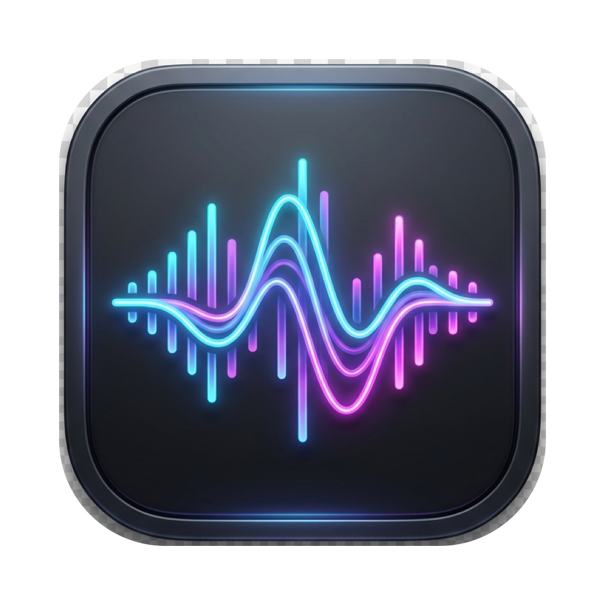
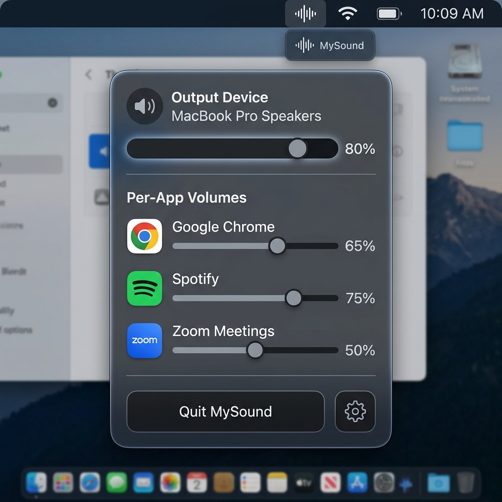

<p align="center">
  
</p>

# MySound

**The ultimate per-app volume controller for macOS.**

MySound gives you total control over your Mac's audio. Adjust the volume of individual applications like Chrome, Spotify, or Zoom independently of your system volume—all from a beautiful, minimalist menu bar interface.

<p align="center">
  
</p>

---

## ✨ Features

- **Per-App Volume Control**: Fine-tune the volume for every running application independently.
- **Direct-Zero CoreAudio Architecture**: Low-latency audio tap routing for perfect sync and crystal-clear sound.
- **Smart App Detection**: Automatically lists active audio-producing applications and groups sub-processes.
- **Native macOS Interface**: Built with Swift and SwiftUI with glassmorphism translucent styling.
- **Launch at Login**: Starts automatically when your Mac turns on.
- **Built-in Auto-Updater**: Check for new releases directly from the menu bar.
- **Standalone DMG Installer**: Instant drag-and-drop installation into `/Applications`.

---

## 🚀 Getting Started

### Prerequisites
- macOS 14.2 (Sonoma) or macOS 15.0+ (Sequoia)
- Apple Silicon (M1/M2/M3/M4) or Intel Mac

### Installation

#### Option 1: Quick Install via DMG (Recommended)
1. Run `./build.sh` to package the app:
   ```bash
   ./build.sh
   ```
2. Open `build/MySound.dmg`.
3. Drag **MySound** directly into your **Applications** folder.

#### Option 2: Build & Run Locally
1. Clone the repository:
   ```bash
   git clone https://github.com/xuanmn/MySound.git
   cd MySound
   ```
2. Build the app bundle:
   ```bash
   ./build.sh
   ```
3. Launch the app:
   ```bash
   open build/MySound.app
   ```

---

## 🔒 Permissions & Privacy Guide

MySound requires specific macOS permissions to intercept per-application audio streams. All audio processing is handled **100% locally on your Mac**.

### 1. Microphone / Audio Recording Access
On first launch, macOS will display a system prompt asking for **Microphone / System Audio Access**.

> [!IMPORTANT]
> **Privacy Guarantee**: MySound **does NOT record your microphone or store your audio**. macOS categorizes CoreAudio process taps (`CATapDescription`) under audio capture permissions. MySound only modifies sample volume gain in memory before outputting to your speakers.

**How to grant permission:**
1. Click **Allow** when the system prompt appears on first launch.
2. If missed, open **System Settings** > **Privacy & Security** > **Microphone** (or **Screen & System Audio Recording** on macOS Sequoia).
3. Ensure the toggle for **MySound** is switched **ON**.

---

### 2. Opening for the First Time (macOS Gatekeeper)
Because MySound is built locally or self-signed, macOS Gatekeeper may show a warning:
`"MySound cannot be opened because it is from an unidentified developer."`

**How to bypass on first launch:**
1. In Finder, navigate to your **Applications** folder.
2. **Right-click** (or `Control` + click) on `MySound.app` and select **Open**.
3. Click **Open** in the confirmation popup window.
4. *Alternative*: Go to **System Settings** > **Privacy & Security**, scroll down to the *Security* section, and click **Open Anyway** next to MySound.

---

### 3. Launch at Login Permission
When you enable **Launch at Login** in the gear menu, MySound registers a login item via Apple's `SMAppService` framework.

**How to manage:**
- Toggle **Launch at Login** directly from the MySound menu bar gear menu.
- Or manage it in **System Settings** > **General** > **Login Items & Extensions**.

---

## 🛠 Troubleshooting

- **An app isn't appearing in the list?** MySound automatically detects applications when they start playing audio. Start playback in the app (e.g. play a song on Spotify or video on YouTube) and it will appear within 2 seconds.
- **Volume slider doesn't change sound?** Ensure MySound has been granted Microphone/Audio Recording permissions under **System Settings > Privacy & Security > Microphone**.
- **Audio distortion or lag?** MySound automatically matches your default audio output sample rate. Try restarting MySound or toggling your output device in System Settings.

---

## 📜 License

This project is licensed under the MIT License - see the [LICENSE](LICENSE) file for details.

---
*Developed with ❤️ by Xuanmn*
